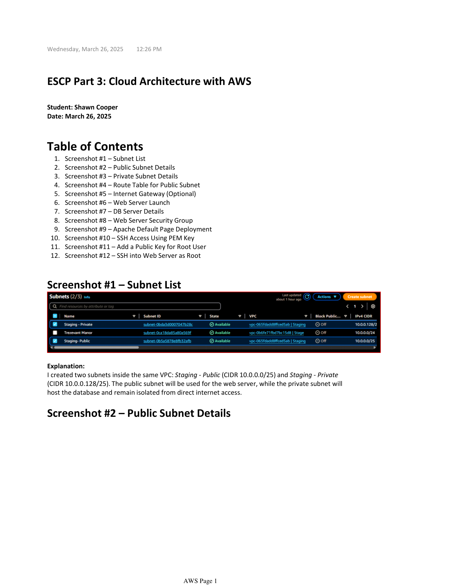
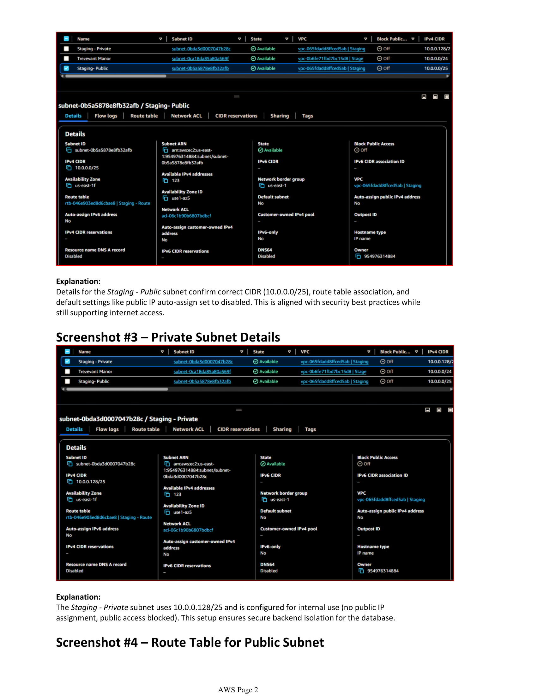
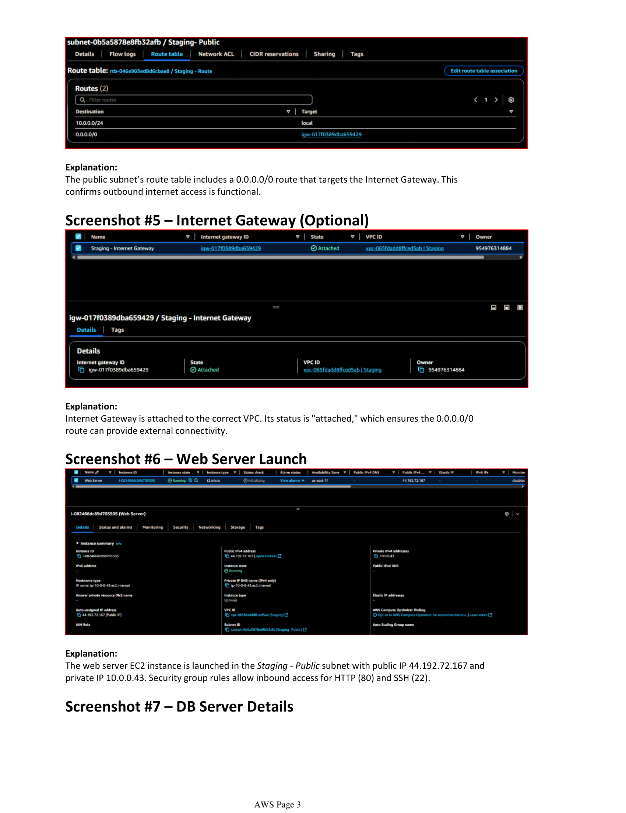
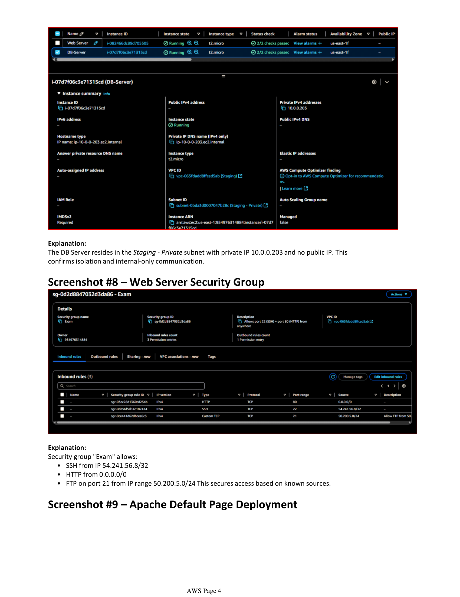
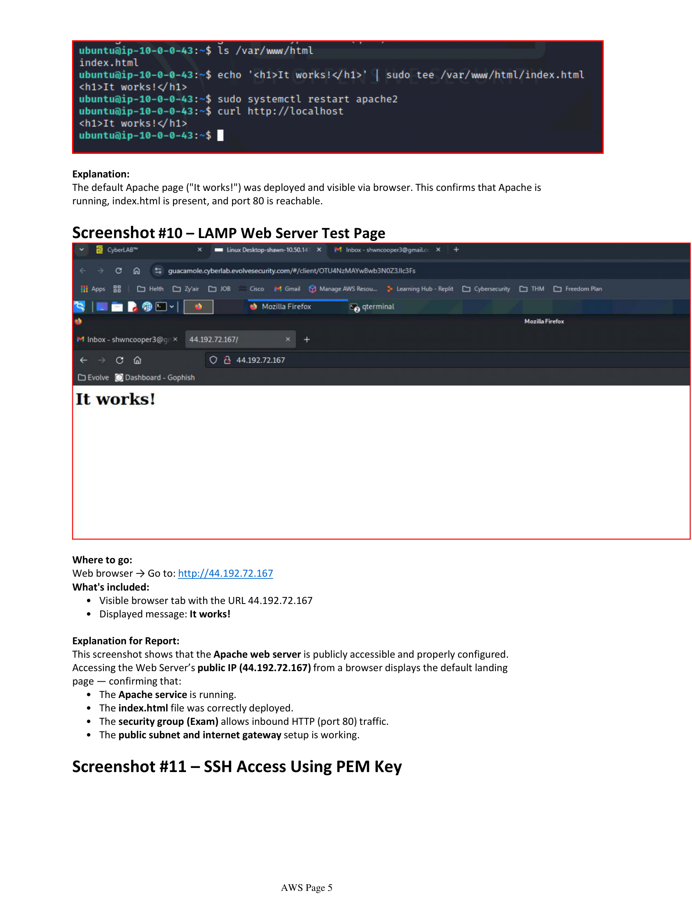
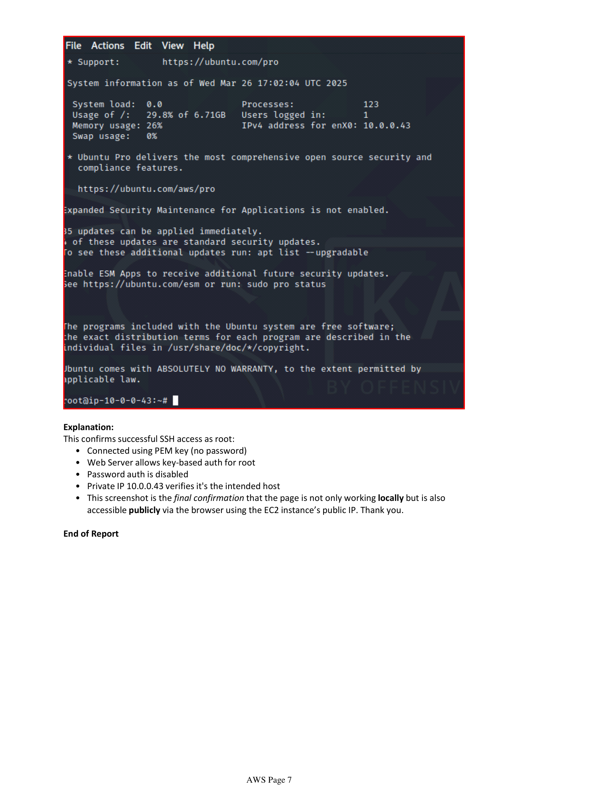

# 🔧 Terraform LAMP Stack Deployment

This project automates the deployment of a secure **LAMP stack (Linux, Apache, MySQL, PHP)** on **AWS EC2** using **Terraform**.

---

## 💡 Project Overview

This was part of my hands-on lab during Evolve Security’s cybersecurity bootcamp. I used Terraform to provision cloud infrastructure that adheres to basic security best practices, with modular and reusable code.

---

## 🔐 Key Features

- EC2 instance with hardened Ubuntu image
- Apache Web Server & PHP
- MySQL setup (remote disabled, secured login)
- Separate VPC, public/private subnets
- Security Groups with least privilege rules
- SSH key pair for secure access
- Outputs public IP of web server

---

## 🧰 Tools & Tech

| Tool        | Purpose                          |
|-------------|----------------------------------|
| Terraform   | Infrastructure as Code (IaC)     |
| AWS EC2     | Host the web application         |
| AWS VPC     | Network isolation                |
| Ubuntu      | Base image for the LAMP stack    |
| GitHub      | Version control & portfolio repo |

---

## 📸 Sample Output

> Coming soon: Architecture diagram + CLI output screenshots

---

## 🧪 How to Use

> _*Note: This is a lab project and assumes you have valid AWS credentials configured locally._  

```bash
git clone https://github.com/Shawn-C-Cooper/terraform-lamp-deployment.git
cd terraform-lamp-deployment
terraform init
terraform plan
terraform apply
---

## 📸 Deployment Screenshots

Here's a visual walkthrough of my AWS LAMP stack deployment using Terraform:

| Step | Description                        | Screenshot                         |
|------|------------------------------------|-------------------------------------|
| 1️⃣   | Subnet setup overview              |       |
| 2️⃣   | Public subnet details              |  |
| 3️⃣   | EC2 launch in AWS                  |   |
| 4️⃣   | Apache “It works!” web server      |       |
| 5️⃣   | SSH PEM access from terminal       |      |
| 6️⃣   | Root access confirmation           |  |
| 7️⃣   | VPC + Architecture Recap           |  |
